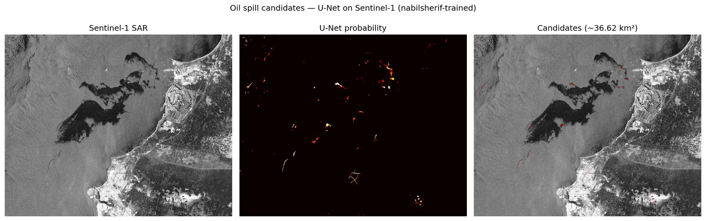
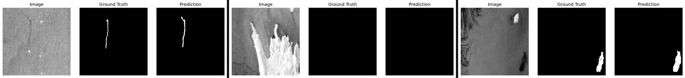
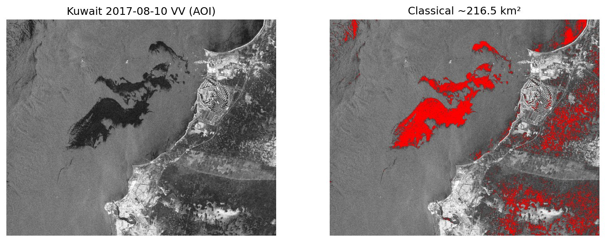

# Детекция нефти на Sentinel-1

U-Net (ResNet34) + калибровка σ⁰ для сегментации нефтяных пятен на Sentinel-1 GRD.

**Val IoU 0.56** · F1 ~0.72 · датасет [nabilsherif/oil-spill](https://www.kaggle.com/datasets/nabilsherif/oil-spill)

<p align="center">
  
</p>

Kuwait 10.08.2017 (известный разлив): классика ~217 км² · U-Net ~37 км² · SkyTruth ~131 км²

| Валидация | Kuwait классика | Kuwait U-Net |
|-----------|-----------------|--------------|
|  |  |  |

## Установка

```bash
git clone https://github.com/fonof/Oil-detection.git
cd Oil-detection
pip install -r requirements.txt
```

Веса: `models/oil_spill_sar_unet.pth` (обучить самому или положить файл вручную).

## Обучение

```bash
# скачать Kaggle nabilsherif/oil-spill в data/
python scripts/prepare_nabilsherif_sar.py

python src/train.py \
  --images_dir data/oil_spill_sar_unet/train/images \
  --masks_dir data/oil_spill_sar_unet/train/masks \
  --val_images_dir data/oil_spill_sar_unet/val/images \
  --val_masks_dir data/oil_spill_sar_unet/val/masks \
  --dataset_name oil_spill_sar \
  --batch_size 8 --epochs 40 --lr 1e-4 \
  --save_path models/oil_spill_sar_unet.pth
```

## Инференс

```bash
python scripts/infer_oil_spill_sar.py \
  --input path/to/sentinel1_normalized_v2.tif \
  --model models/oil_spill_sar_unet.pth \
  --output_dir output/run
```

## Kuwait 2017 (ASF / Earthdata)

```bash
# один раз: https://urs.earthdata.nasa.gov/approve_app?client_id=BO_n7nTIlMljdvU6kRRB3g
set EARTHDATA_USERNAME=...
set EARTHDATA_PASSWORD=...
python scripts/download_kuwait_oil_spill.py
python scripts/prepare_kuwait_oil_spill.py
python scripts/infer_oil_spill_sar.py \
  --input data/kuwait_2017_oil/S1A_IW_GRDH_1SDV_20170810T024714_20170810T024738_017855_01DEF7_F48C.SAFE/output/sentinel1_normalized_v2.tif \
  --output_dir output/kuwait
```

Продукт: `S1A_IW_GRDH_1SDV_20170810T024714_20170810T024738_017855_01DEF7_F48C`

## Структура

```
src/        train, model, dataset
scripts/    prepare / download / infer
assets/     примеры результатов
models/     *.pth (не в git)
```

Look-alike (штиль, дельты) дают ложные срабатывания — это ограничение SAR, не баг пайплайна.

MIT · ESA Sentinel-1 · ASF · nabilsherif (Kaggle)
